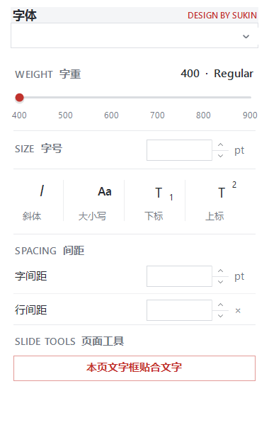

# PowerPoint 文字工具

一个面向 Microsoft PowerPoint for Windows 的轻量文字与排版侧边栏插件。

> V1.0.0 · DESIGN BY SUKIN



## 功能

- 字体家族搜索、模糊搜索与下拉选择
- 自动读取当前选中文字/文字框的字体和字重
- 自绘字重滑杆，支持点击、拖动与滚轮切换
- 字号实时调整：输入、上下按钮、滚轮、上下拖动
- 斜体
- 大小写三态循环：全部大写 / 句首大写 / 每词首字母大写
- 上标 / 下标
- 字间距实时调整
- 行间距实时调整
- 当前页文字框贴合文字
- PowerPoint 原生右侧 Custom Task Pane
- PowerPoint 红色视觉体系

## 环境

- Windows 10 / 11 x64
- Microsoft PowerPoint Desktop x64
- Office 2024 / Microsoft 365 桌面版
- .NET Framework 4.x

当前 V1.0.0 仅提供 Windows x64 版本。

## 安装

1. 下载并解压 `PowerPoint-Text-Tools-v1.0.0.zip`。
2. 放到一个长期保留的目录，例如 `C:\PowerPointTextTools`。
3. 在该目录打开 PowerShell，运行：

```powershell
Set-ExecutionPolicy -Scope Process Bypass
.\install.ps1
```

4. 完全退出并重新打开 PowerPoint。
5. 在 PowerPoint「开始」选项卡中点击「文字工具」。

> 安装后不要移动 `OfficeSmartFontPicker.dll`，否则需要重新运行安装脚本。

## 卸载

```powershell
Set-ExecutionPolicy -Scope Process Bypass
.\uninstall.ps1
```

然后重新启动 PowerPoint。

## 交互

### 字重
支持点击轨道、拖动红色圆形滑块、鼠标滚轮。

### 字号 / 字间距 / 行间距
支持直接输入、上下按钮、鼠标滚轮、在数值区按住鼠标上下拖动；按住 Shift 可加速调节。

### 大小写
`Aa` 按钮循环三种模式：

1. 红色：全部大写
2. 橙色：句首字母大写
3. 蓝色：每个单词首字母大写

## 已知限制

- 不同字体在 PowerPoint COM 中暴露的真实字重能力并不完全一致，插件只显示当前能够较可靠调用的字重。
- 部分 Variable Font 的中间轴值无法通过 PowerPoint COM 精确控制。
- 当前版本仅面向 PowerPoint Windows 桌面版。
- 「文字框贴合文字」主要面向普通文字框、占位符和透明文字 AutoShape，复杂组合对象可能存在例外。

## 源码

主源码：

`src/SmartFontPicker.cs`

编译产物：

`dist/OfficeSmartFontPicker.dll`

## 版本

### V1.0.0

首个公开版本，包含字体选择、实时字重、字号、间距、大小写、斜体、上下标以及文字框贴合功能。

## License

当前版本暂未指定开源许可证。
